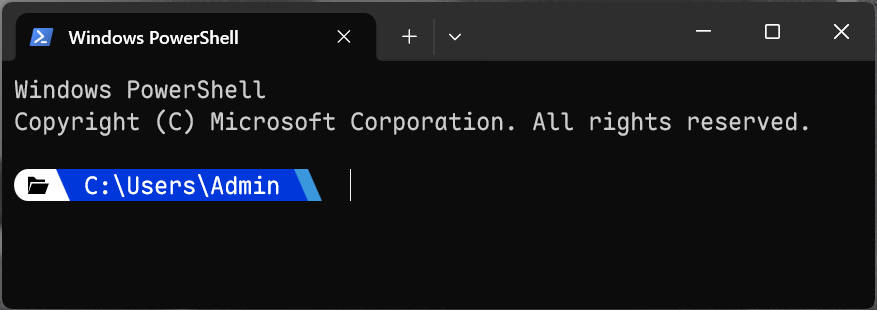

# WinTerminal-Prompt

A clean PowerShell prompt theme for Windows Terminal.

## Screenshot



## Installation

1. Download `profile.ps1`
2. Add to your PowerShell profile: `$PROFILE`

## Code

```powershell
function prompt {
    $esc = [char]27
    $leftSolidHalf = [char]0xE0B6
    $rightSlant = [char]0xE0B8
    $folder = [char]0xE5FE

    $darkBlueFg = "38;2;0;55;218"
    $darkBlueBg = "48;2;0;55;218"
    $lightBlueFg = "38;2;58;150;221"
    $lightBlueBg = "48;2;58;150;221"
    $whiteFg = "38;2;255;255;255"
    $whiteBg = "48;2;255;255;255"
    $blackFg = "38;2;0;0;0"

    $fullPath = $PWD.Path -replace '/', '\'

    Write-Host "$esc[${whiteFg}m$leftSolidHalf" -NoNewline
    Write-Host "$esc[${blackFg};${whiteBg}m$folder " -NoNewline
    Write-Host "$esc[${whiteFg};${darkBlueBg}m$rightSlant" -NoNewline
    Write-Host "$esc[${whiteFg};${darkBlueBg}m $fullPath " -NoNewline
    Write-Host "$esc[${darkBlueFg};${lightBlueBg}m$rightSlant" -NoNewline
    Write-Host "$esc[${lightBlueFg};49m$rightSlant" -NoNewline
    Write-Host "$esc[0m " -NoNewline

    return " "
}
```

## License

[MIT License](LICENSE)